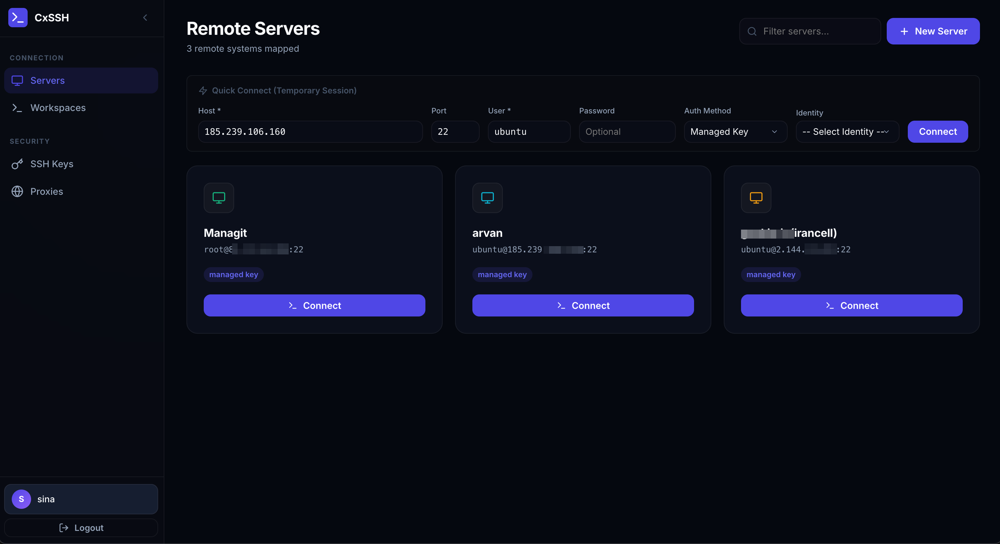

# CxSSH — Web SSH Manager

[](https://www.docker.com/)
[](https://nodejs.org/)

A self-hosted, dockerised SSH client that runs entirely in your browser. Sleek single-page interface with tab management, resizable gridded layouts, proxy tunneling, secure local key storage, custom themes, and background session persistence.



---

## ✨ Features

- 🖥️ **SPA Desktop UI**: Sleek, glassmorphism-based single page application.
- 🗂️ **Draggable Tabs & Grid Layout**: Open multiple terminals side-by-side. Drag tabs to reorder, or drag borders to resize window widths.
- 📌 **Permanent Workspaces**: Optional background session persistence that survives browser refreshes, window closures, and network drops:
  - **Memory Registry**: Keeps dead client connections alive on the server for up to 30 minutes of idle time.
  - **150KB Ring Buffer**: Captures recent terminal outputs so everything is instantly replayed when you reconnect.
  - **Auto-Restore**: Automatically restores and re-establishes all active permanent sessions upon page reload.
  - **Teardown Control**: Cleanly detach from UI and let processes continue, or click **Kill** to immediately terminate the SSH process on the remote server and database.
- 🎨 **Terminal Themes**: Personalize each server profile with one of 7 curated visual terminal themes:
  - *Default Dark, Midnight Blue, Dracula, Retro Matrix, Solarized Dark, Nord, or Paper Light*.
  - Includes a **Live Visual Theme Preview** mock terminal right inside the server editor modal!
- 📐 **Unified Sizing Controls**:
  - **Fit Button**: Quick-sync button inside the terminal header to instantly force-align PTY size (highly useful when launching CXSSH concurrently across multiple screens or browsers).
  - **Auto-Resizer**: Seamlessly fits terminals upon resizing, toggling sidebars, switching layout modes, or restoring layouts.
  - **Tab Overrides**: Inline styles automatically adjust so custom resized grids expand to full-width when switched to tabbed view.
- 🌐 **Proxy Tunneling**: Route SSH traffic through SOCKS5 or HTTP proxies.
- 🔐 **Secure & Private**: JWT Auth, secure cookies, and local database (SQLite) for storing server profiles and SSH Keys.
- 🚪 **Auto-Focus Redirection**: Closing or killing the active terminal instantly focuses the next available active tab, avoiding blank UI viewports.

---

## 🚀 Quick Start

```bash
# 1. Clone & enter
git clone https://github.com/nos486/cxssh.git && cd cxssh

# 2. Setup env
cp .env.example .env
# Edit .env and change ADMIN_PASSWORD and JWT_SECRET!

# 3. Build & Run
docker build -t cxssh .
docker-compose up -d
```

Open **`http://localhost:3000/app`** (Default: `admin` / `admin`).

---

## 📐 Layout Controls

- **Resize**: Hover between terminal windows in grid mode and drag to adjust width.
- **Equalize**: Double-click the resize border to reset layout widths evenly.
- **Fit Size**: Click **Fit** inside any terminal window header to force terminal scale re-calculation (perfect for multi-monitor / dual-browser setups).

---

## 🎨 Themes & Customization

1. Create or edit a server profile in the **Servers** manager.
2. Select a **Terminal Theme** from the dropdown. 
3. Watch the **Mock Terminal Preview** dynamically render prompt, code colors, folders, and text using the theme's colors in real-time.
4. Click **Save**—the theme will be applied persistently every time you connect!

---

## 🌐 Proxy Setup

1. Add SOCKS5/HTTP proxies in the **Proxies** tab.
2. Link any proxy profile to a server in the **Servers** manager.

---

## 🔒 Security Notes

- Change default credentials before exposing to the internet.
- Put behind a reverse proxy (like Nginx Proxy Manager, Nginx, or Caddy) with SSL enabled.
